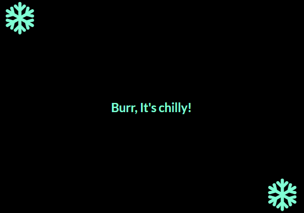

This season app made using react displays  this when it is summer in the region where user is residing and  if user is residing in the region where it is winter.

If the location access has been blocked by your browser it will show an error.
"Error: User Denied GeoLocation"